# Dependency Graph - Feature Migration Order

**Purpose:** Visual representation of feature dependencies
**Format:** Mermaid diagrams
**Last Updated:** 2026-02-13

---

## Overview

This document shows the dependency relationships between all features. Features must be migrated in dependency order - a feature can only be started when all its dependencies are complete.

**Legend:**
- 🔴 P0 - Critical (must migrate first)
- 🟡 P1 - Core (migrate after P0)
- 🟢 P2 - Important (migrate after P1)
- 🔵 P3 - Enhanced (migrate after P2)

---

## High-Level Overview

```mermaid
graph TD
    A[🔴 P0: Infrastructure] --> B[🟡 P1: Core Forum]
    B --> C[🟢 P2: Moderation/Admin]
    C --> D[🔵 P3: Enhanced Features]

    A --> A1[Configuration]
    A --> A2[Bootstrap]
    A --> A3[Database Layer]
    A2 --> A4[Authentication]
    A2 --> A5[Caching]
    A2 --> A6[Session Management]
    A4 --> A7[User Login]

    B --> B1[Forum Navigation]
    B --> B2[Thread Management]
    B --> B3[Posting System]
    B --> B4[User Management]
    B1 --> B2
    B2 --> B3

    C --> C1[Moderation System]
    C --> C2[Search System]
    C --> C3[Private Messaging]
    C --> C4[Attachment System]
    C --> C5[Admin Control Panel]
    C1 --> C5

    D --> D1[Social Features]
    D --> D2[Gamification]
    D --> D3[Template System]
    D --> D4[Plugins]
```

---

## P0 Critical Dependencies

---

## P1 Core Dependencies

---

## P2 Moderation Dependencies

---

## P2 Search Dependencies

---

## P2 PM & Attachments Dependencies

---

## P2 AdminCP Dependencies

---

## P3 Social Features Dependencies

---

## P3 Gamification Dependencies

---

## P3 Template & Plugin Dependencies

---

## P3 Custom PoketTB Features Dependencies

---

## P3 UC Integration Dependencies

---

## Critical Path Analysis

### Absolute Critical Path (Must Follow)

**Timeline:** Days 1-40

---

## Parallel Development Opportunities

After Day 40 (P1 core complete), these can be developed in parallel:

### Team A (Moderation)
- ModCP System
- Search System
- Report System

### Team B (Admin)
- AdminCP
- Settings Management
- User Management

### Team C (User Features)
- Private Messaging
- Attachments
- User Profile Enhancements

---

## Dependency Risk Assessment

### High Risk (Single Point of Failure)
1. **Core Bootstrap** - Everything depends on this
2. **Database Layer** - All data access
3. **Authentication** - All protected features

### Medium Risk (Multiple Dependencies)
1. **Forum Display** - 15+ features depend
2. **Post Controller** - 10+ features depend
3. **User Management** - 20+ features depend

### Low Risk (Few Dependencies)
1. Most P3 features
2. Standalone plugins
3. Template customizations

---

## Migration Sequence Summary

### Phase 1: Foundation (Days 1-15)
- P0 Infrastructure
- No parallel work possible

### Phase 2: Core (Days 16-50)
- P1 Features
- Limited parallel work after Day 30

### Phase 3: Important (Days 51-80)
- P2 Features
- Heavy parallel work possible

### Phase 4: Enhanced (Days 81-120)
- P3 Features
- Maximum parallel work

---

## Notes

1. **Circular Dependencies:** None detected
2. **Orphan Features:** None (all have dependencies)
3. **Missing Dependencies:** None detected
4. **Recommendation:** Follow critical path strictly for first 40 days

---

## Dependency Matrix

| Feature | Depends On | Blocks | Risk Level |
|---------|-----------|--------|-----------|
| Configuration | None | Bootstrap, DB | 🔴 High |
| Bootstrap | Configuration | All features | 🔴 High |
| Database Layer | Bootstrap | All data features | 🔴 High |
| Authentication | Bootstrap, DB, Cache, Session | All protected features | 🔴 High |
| Forum Index | P0 | All forum features | 🟡 Medium |
| Forum Display | Forum Index | Thread view, post, mod | 🟡 Medium |
| Thread Viewing | Forum Display | Posting, moderation | 🟡 Medium |
| Post Controller | Thread view, New thread | Attachments, moderation | 🟡 Medium |
| User Management | P0 | All user features | 🟡 Medium |
| AdminCP | P0 | All admin features | 🟢 Low |
| Plugins | P0 | All plugins | 🟢 Low |
| Social Features | P1, User Mgmt | None | 🟢 Low |
| Gamification | P1, User Mgmt | Custom features | 🟢 Low |
| Template System | P0, Cache | Theme customization | 🟢 Low |
| UC Integration | P0, P1 features | Sync features | 🟢 Low |

---

**Document Status:** ✅ Complete
**Next Document:** 06-execution-sprints.md
